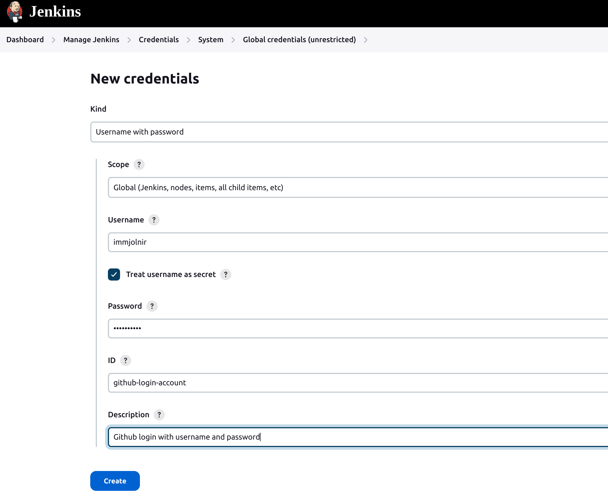
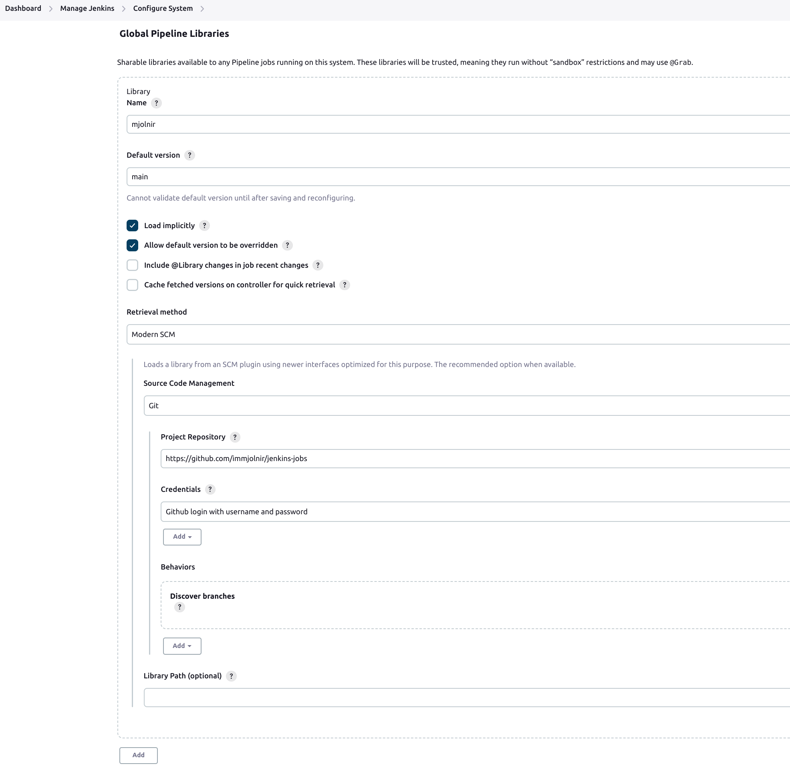

# jenkins-jobs

Setup Jenkins

## Add credentials



## [Extending with Shared Libraries](https://www.jenkins.io/doc/book/pipeline/shared-libraries/)
* Global Shared Libraries
There are several places where Shared Libraries can be defined, depending on the use-case.

**Manage Jenkins** » **Configure System** » **Global Pipeline Libraries** as many libraries as necessary can be configured.


* Directory structure
The directory structure of a Shared Library repository is as follows:
```
(root)
+- src                     # Groovy source files
|   +- org
|       +- foo
|           +- Bar.groovy  # for org.foo.Bar class
+- vars
|   +- foo.groovy          # for global 'foo' variable
|   +- foo.txt             # help for 'foo' variable
+- resources               # resource files (external libraries only)
|   +- org
|       +- foo
|           +- bar.json    # static helper data for org.foo.Bar
```

* The `src` directory should look like standard Java source directory structure. This directory is added to the classpath when executing Pipelines.

* The `vars` directory hosts script files that are exposed as a variable in Pipelines. The name of the file is the name of the variable in the Pipeline. So if you had a file called `vars/log.groovy` with a function like `def info(message)…` it, you can access this function like `log.info "hello world"` in the Pipeline. You can put as many functions as you like inside this file. Read on below for more examples and options.


# Plugins
* Blue Ocean
* [github-api](https://github.com/hub4j/github-api)
* [GitHub Branch Source Plugin](https://github.com/jenkinsci/github-branch-source-plugin)
* [Jenkins Job DSL Plugin](https://github.com/jenkinsci/job-dsl-plugin)
- [pipeline-github-plugin](https://github.com/jenkinsci/pipeline-github-plugin): Pipeline: Github
  - "pullRequest" is a global variable.
  - src/main/java/org/jenkinsci/plugins/pipeline/github/PullRequestGlobalVariable.java
  - src/main/java/org/jenkinsci/plugins/pipeline/github/GitHubPipelineGlobalVariables.java

# Tools
* [Jenkinsfile Runner (Incubating project)](https://github.com/jenkinsci/jenkinsfile-runner)


# [Jenkins Job Builder](https://jenkins-job-builder.readthedocs.io/en/latest/quick-start.html)
Jenkins Job Builder takes simple descriptions of Jenkins jobs in YAML or JSON format and uses them to configure Jenkins. You can keep your job descriptions in human readable text format in a version control system to make changes and auditing easier. It also has a flexible template system, so creating many similarly configured jobs is easy.

# [python jenkins](https://python-jenkins.readthedocs.io/en/latest/examples.html)
## examples
* add_slaves.py
* get_jenkins_jobs_count.py
* get_jenkins_version.py


## Issues

* Github API Quata
```
13:59:40 Jenkins-Imposed API Limiter: Current quota for Github API usage has 52 remaining (1 over budget). Next quota of 60 in 59 min. Sleeping for 5 min 1 sec.
13:59:40 Jenkins is attempting to evenly distribute GitHub API requests. To configure a different rate limiting strategy, such as having Jenkins restrict GitHub API requests only when near or above the GitHub rate limit, go to "GitHub API usage" under "Configure System" in the Jenkins settings.
```
